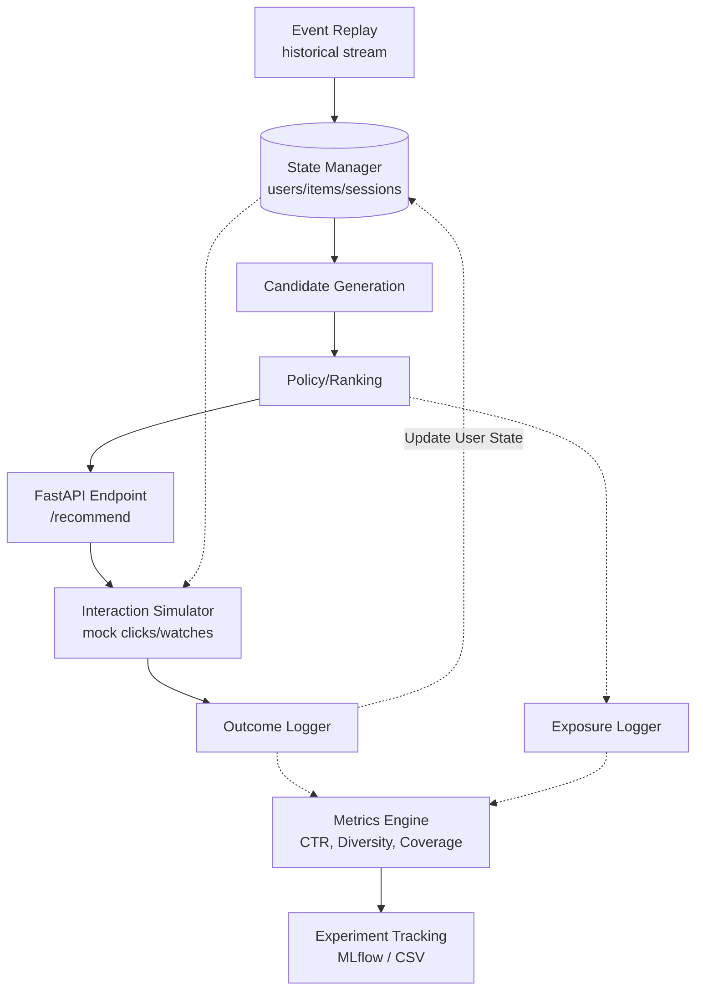

# DiscoveryRank: End-to-End Recommendation System Prototype

**Author:** Jasjyot Singh  
**Release Status:** v2.0 – Complete Online Recommendation Loop

> **Repo Description:** End-to-end short-video recommendation system prototype with replay, serving, logging, simulation, and offline evaluation.

---

## What It Does

DiscoveryRank is a fully functional, end-to-end recommendation system prototype demonstrating the entire lifecycle of a ranking engine. It replays historical interaction data, maintains dynamic in-memory user and item states, generates personalized candidate pools, ranks them using pluggable policies, serves them via a Fast REST API, simulates probabilistic user interactions natively, and logs the outcomes.

By running this continuous online loop, the system captures the long-term impacts of ranking algorithms, using offline metrics (like Click-Through Rate, Diversity, Novelty, and Serendipity) as the evaluation backbone to measure how algorithms physically reshape a user's catalog exposure over time.

---

## Quick Start & Demo

### 1. Run the Full Experiment via CLI

Execute the end-to-end simulation loop from the command line. This replays history to warm up the state, simulates future sessions, and evaluates the tradeoffs of a specific policy.

```bash
python run_simulation.py --policy hybrid --events 10000
```
*(Available policies: `popularity`, `recency_decay`, `hybrid`. Produces a metrics summary and saves a comparison `.csv` and `.png` to `outputs/experiments/`)*

### 2. Stand up the Local API

Serve recommendations dynamically based on the current warmed state using FastAPI:

```bash
uvicorn src.api.recommendation_api:app --reload
```

Test the endpoint manually with curl or your browser to request a new session:
```bash
curl "http://127.0.0.1:8000/recommend?user_id=1&session_id=new_sess&k=3"
```

**Sample API Response:**
```json
{
  "user_id": "1",
  "recommendations": [
    {
      "item_id": "3080",
      "score": 0.0001
    },
    {
      "item_id": "1021",
      "score": 0.0001
    },
    {
      "item_id": "7187",
      "score": 0.0001
    }
  ]
}
```

---

## System Architecture

The prototype relies on cyclical interaction between the serving layer and the simulation environment:



---

## Results & Tradeoffs

Running the online loop reveals the classic recommendation system tensions:
- **Popularity-based Policies** win immediate proxy engagement (highest CTR and Watch Time) but suffer from the lowest diversity, creator spread, and catalog coverage. They quickly trap users in filter bubbles.
- **Hybrid (Diversity-Aware) Policies** win layout diversity, creator spread, and overall catalog coverage, explicitly trading a slight drop in immediate engagement for massive gains in discovery.

---

## Repository Structure

The architecture is cleanly separated into data, features, serving, simulation, and evaluation modules:

```text
recommendation-quality-lab/
├── app/
│   └── filter_bubble_simulator.py  # Interactive Streamlit visualizer
├── docs/                           # Architecture diagrams & context
├── outputs/
│   └── experiments/                # Generated metrics CSVs and PNGs
├── src/
│   ├── api/
│   │   └── recommendation_api.py   # FastAPI Serving layer
│   ├── data/
│   │   ├── event_replay.py         # Chronological event stream
│   │   └── event_schema.py         # Canonical typing
│   ├── evaluation/
│   │   └── metrics_extensions.py   # Code for Diversity, Spread, CTR
│   ├── features/
│   │   ├── state_manager.py        # Central memory store
│   │   ├── user_state.py           # Historical behavior tracking
│   │   └── item_state.py           # Item exposure tracking
│   ├── logging_layer/
│   │   ├── exposure_logger.py      # Logs recommendation views
│   │   └── outcome_logger.py       # Logs simulated interactions
│   ├── serving/
│   │   ├── recommender_service.py  # Pipeline (Candidates -> Rank -> Top-K)
│   │   └── ranking_strategies.py   # Popularity, Freshness, Hybrid implementations
│   └── simulation/
│       └── interaction_simulator.py # Probabilistic outcome generation
├── run_simulation.py               # End-to-end CLI runner
├── run_all.py                      # Batch script for offline data prep
└── requirements.txt
```

---

## Run Locally

It takes about 2 minutes to run the entire prototype locally.

### 1. Install Dependencies
```bash
python -m venv .venv
source .venv/bin/activate    # Windows: .venv\Scripts\activate
pip install -r requirements.txt
```

### 2. Base Evaluation Run
Extracts data, computes offline metrics, generates initial plots, and logs to MLflow.
```bash
python run_all.py
```
*(Requires KuaiRand-1K CSVs extracted into `data/`)*

### 3. Interactive Simulator
A visual tool demonstrating how algorithm choice alters user exposure over repeated sessions.
```bash
streamlit run app/filter_bubble_simulator.py
```

---

## Limitations

Please evaluate this prototype with the following constraints in mind:

1. **Local Prototype:** This is a sophisticated experimentation lab, not a web-scale production system. There is no live backend database.
2. **Simulated Feedback:** The `InteractionSimulator` approximates human behavior using heuristic probabilities based on user history. It is deterministic enough to prove the ranking math works, but it does not represent actual human volatility.
3. **In-Memory State:** The `StateManager` holds user/item representations entirely in application memory via dictionaries rather than a persistent Feature Store or Redis cache.
4. **Missing Two-Stage Retrieval:** The candidate generation step operates over a pre-filtered dataframe subset. Large-scale production systems use fast Approximate Nearest Neighbor (ANN) indices to achieve this recall before applying the heavy ranking logic.
