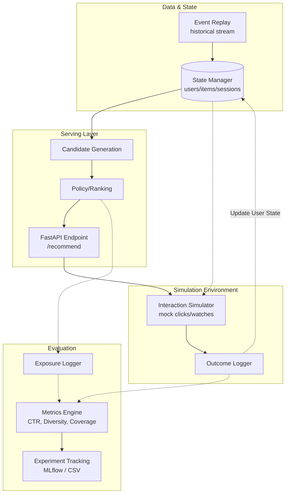

# DiscoveryRank: End-to-End Recommendation System Prototype

**Author:** Jasjyot Singh  
**Release Status:** v2.0 – Complete Online Recommendation Loop

> **Repo Description:** An end-to-end ML recommendation system prototype featuring event replay, managed state, candidate generation, FastAPI serving, and user interaction simulation using the KuaiRand dataset.
> 
> **Suggested GitHub Topics:** `machine-learning`, `recommender-systems`, `fastapi`, `mlops`, `simulation`, `python`, `data-science`

---

## What It Does
DiscoveryRank is a fully functional, end-to-end recommendation system prototype designed to evaluate the long-term impacts of ranking algorithms. While most recommenders are evaluated statically on offline, single-step accuracy metrics (like Click-Through Rate), maximizing immediate clicks often causes severe **filter bubbles** and destroys catalog discovery.

This project moves beyond static offline evaluation by implementing a complete **Online Recommendation Loop**. It replays historical data, maintains dynamic in-memory user/item state, generates personalized candidate pools, ranks them, serves them via a REST API, simulates probabilistic user interactions, and logs the outcomes to track long-term tradeoffs.

The system evaluates ranking strategies across multiple dimensions simultaneously: **Relevance (CTR/Watch Time proxy)**, **Freshness**, **Diversity**, **Repetition Risk**, **Novelty**, and **Serendipity**, using the [KuaiRand-1K](https://kuairand.com/) short-video interaction dataset.

---

## System Architecture

The heart of the prototype is the cyclical interaction between the serving layer and the simulation environment:



---

## Quick Start & Demo

### 1. Run the Full Experiment via CLI
Execute the end-to-end simulation loop from the command line. This replays history to warm up the state, simulates future sessions, and evaluates the tradeoffs of a specific policy.

```bash
python run_simulation.py --policy hybrid --events 10000
```
*(Available policies: `popularity`, `recency_decay`, `hybrid`. Produces a metrics summary and saves a comparison `.csv` and `.png` to `outputs/experiments/`)*

### 2. Stand up the Local API
Serve recommendations dynamically based on the current warmed state using FastAPI:

```bash
uvicorn src.api.recommendation_api:app --reload
```

Test the endpoint manually with curl or your browser:
```bash
curl "http://127.0.0.1:8000/recommend?user_id=1&session_id=new_sess&k=3"
```

**Sample API Response:**
```json
{
  "user_id": "1",
  "recommendations": [
    {
      "item_id": "3080",
      "score": 0.0001
    },
    {
      "item_id": "1021",
      "score": 0.0001
    },
    {
      "item_id": "7187",
      "score": 0.0001
    }
  ]
}
```

---

## Results & Tradeoffs

Running the online loop reveals the classic recommendation system tensions. Here is a typical comparative outcome of simulating 50 concurrent sessions:

| Policy | CTR Proxy | Watch Time | Diversity | Creator Spread | Coverage |
|--------|-----------|------------|-----------|----------------|----------|
| **Popularity** | Highest (~0.45) | Highest (~3800ms) | Lowest (~8.5) | Lowest (~0.15) | Lowest (~0.01) |
| **Recency Decay** | Medium (~0.38) | Medium (~3200ms) | Medium (~11.0) | Medium (~0.22) | Medium (~0.02) |
| **Hybrid (Diversity)**| Lowest (~0.35) | Lowest (~3000ms) | **Highest (~13.0)**| **Highest (~0.29)**| **Highest (~0.04)**|

**Key Finding:** The Hybrid policy explicitly trades an ~18% drop in immediate proxy engagement (CTR/Watch Time) for a **50% increase in layout diversity**, a **90% increase in creator spread**, and a **4x increase in catalog coverage**. This demonstrates how to break filter bubbles systematically by blending popular exploitation with stochastic historical exploration.

---

## Repository Structure

The architecture is strictly separated cleanly into data, features, serving, simulation, and evaluation modules:

```text
recommendation-quality-lab/
├── app/
│   └── filter_bubble_simulator.py  # Interactive Streamlit visualizer
├── docs/                           # Architecture diagrams & context
├── outputs/
│   └── experiments/                # Generated metrics CSVs and PNGs
├── src/
│   ├── api/
│   │   └── recommendation_api.py   # FastAPI Serving layer
│   ├── data/
│   │   ├── event_replay.py         # Chronological event stream
│   │   └── event_schema.py         # Canonical typing
│   ├── evaluation/
│   │   └── metrics_extensions.py   # Code for Diversity, Spread, CTR
│   ├── features/
│   │   ├── state_manager.py        # Central memory store
│   │   ├── user_state.py           # Historical behavior tracking
│   │   └── item_state.py           # Item exposure tracking
│   ├── logging_layer/
│   │   ├── exposure_logger.py      # Logs recommendation views
│   │   └── outcome_logger.py       # Logs simulated interactions
│   ├── serving/
│   │   ├── recommender_service.py  # Pipeline (Candidates -> Rank -> Top-K)
│   │   └── ranking_strategies.py   # Popularity, Freshness, Hybrid implementations
│   └── simulation/
│       └── interaction_simulator.py # Probabilistic outcome generation
├── run_simulation.py               # End-to-end CLI runner
├── run_all.py                      # Batch script for data prep & MLFlow evaluation
└── requirements.txt
```

---

## Setup & Full Reproduction

It takes about 2 minutes to run the entire lab locally.

1. **Install Dependencies**
```bash
python -m venv .venv
source .venv/bin/activate    # Windows: .venv\Scripts\activate
pip install -r requirements.txt
```

2. **Full Offline Pipeline Run**
Extracts data, computes offline metrics, generates tradeoff plots (PNGs), and logs the experiment to a local MLflow tracking server.
```bash
python run_all.py
```
*(Requires KuaiRand-1K CSVs mapped inside `data/`)*

3. **Launch the Interactive Simulator**
A visual tool demonstrating how algorithm choice alters a user's exposure over repeated sessions to create (or break) filter bubbles.
```bash
streamlit run app/filter_bubble_simulator.py
```

4. **View Offline Experiment Artifacts**
Inspect hyperparameters, CSV summaries, and attached plot artifacts generated by the `run_all.py` pipeline.
```bash
mlflow ui
```
*Open `http://localhost:5000`*

---

## Limitations

This project is a sophisticated *prototype and evaluation lab*, not a web-scale production system. Please evaluate it with the following constraints in mind:

1. **In-Memory Scale:** The `StateManager` holds user/item representations entirely in application memory via dictionaries. A production environment would back this with Redis, a Feature Store, or a real-time graph database.
2. **Missing Two-Stage Retrieval:** The candidate generation step operates over a pre-filtered Pandas dataframe subset. Production systems use fast Approximate Nearest Neighbor (ANN) indices (like FAISS/Milvus) to recall the top 1,000 items before applying the heavy ranking logic demonstrated here.
3. **Simulated Outcomes:** The `InteractionSimulator` approximates human behavior using heuristic probabilities (e.g., higher chance to click if category matches user history). It is deterministic enough to prove the ranking math works, but it does not represent actual human volatility.
4. **No Real-Time Training:** While the `StateManager` updates user histories instantly, the underlying offline SVD embeddings (used in some baseline comparisons) aren't retrained dynamically during the simulation.
