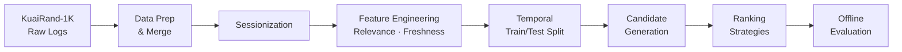
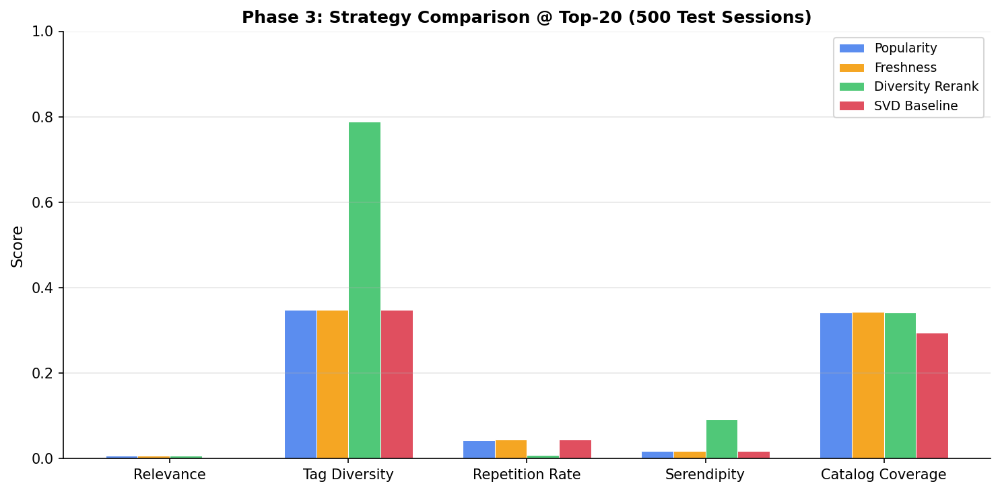

# DiscoveryRank: Recommendation Quality Evaluation Lab

**Author:** Jasjyot Singh

## Release Status
Version: v1.0 – DiscoveryRank
Status: Stable research / evaluation framework

This project provides an offline framework for evaluating recommendation-quality tradeoffs across multiple ranking strategies using the KuaiRand dataset.

---

I built this project to evaluate recommendation ranking strategies beyond raw engagement accuracy. Most recommender evaluations focus on a single dimension — click-through rate or completion — but real recommendation quality is multi-dimensional. A strategy that maximizes clicks can easily trap users in repetitive filter bubbles with no topical diversity and zero discovery of new content.

This framework evaluates ranking strategies across six dimensions simultaneously: **Relevance**, **Freshness**, **Diversity**, **Repetition Risk**, **Novelty**, and **Serendipity**, using the [KuaiRand-1K](https://kuairand.com/) short-video interaction dataset (~43K interactions, ~1K users, ~7K items).

The project's main contribution is a clean, modular offline evaluation pipeline that generates realistic candidate pools, applies multiple ranking strategies to identical pools, and measures the resulting quality tradeoffs honestly — including cases where a learned model does not outperform simple heuristics.

---

## Pipeline Architecture

The project follows a modular offline recommender architecture with strict temporal separation between training and evaluation data:



| Stage | Module | What It Does |
|---|---|---|
| Data Prep | `src/data_prep.py` | Merges KuaiRand-1K interaction logs with video metadata |
| Sessionization | `src/session_builder.py` | Groups interactions into viewing sessions using time-gap heuristics |
| Relevance Labels | `src/relevance_labels.py` | Derives binary `y_relevant` from explicit signals (like/follow/comment) and implicit completion ratio |
| Freshness Features | `src/freshness_features.py` | Computes `item_age_days` relative to each interaction's timestamp |
| Candidate Generation | `src/candidate_generation.py` | Builds time-safe 100-item pools blending observed, popular, history-adjacent, and random items |
| Ranking | `src/ranking_strategies.py` | Heuristic rankers: popularity, freshness-boosted, diversity-aware rerank |
| ML Baseline | `src/model_baselines.py` | Truncated SVD matrix factorization via scipy |
| Evaluation | `src/eval_metrics.py` | Scores ranked lists on relevance, freshness, diversity, repetition, novelty, serendipity |

### Key Design Decisions

- **Candidate generation vs. ranking**: These are separate stages. The candidate generator builds a pool of 100 items from multiple sources using only past data. Rankers then score and reorder that same pool. This mirrors production two-stage recommender architectures and ensures all strategies are compared on identical candidate sets.
- **Temporal split**: The dataset is split chronologically (80/20) so the SVD model trains only on past data and candidate pools draw only from historical interactions. No future data leaks into evaluation.

---

## Project Phases

### Phase 1 — Baseline Evaluation
Evaluated three heuristic ranking strategies (popularity, freshness-boosted, diversity-aware rerank) on small observed-only session pools. Established the evaluation framework and metric definitions.

### Phase 2 — Realistic Candidate Pools
Moved from reranking only the 3–5 observed items per session to generating realistic 100-item candidate pools. This stressed the strategies properly — finding relevant items among 97 assumed-negative decoys is harder than sorting a handful of positives. The diversity-aware reranker showed its first clear advantage here, doubling tag diversity without losing relevance.

### Phase 3 — ML Baseline & Advanced Metrics
Added a strict temporal train/test split, a learned Truncated SVD baseline, and three advanced metrics: novelty (catalog rarity), serendipity (novel + relevant), and global catalog coverage. Tracked which candidate source (observed, popular, history, random) dominated each strategy's Top-20.

---

## Experiment Design & Findings

### What Was Tested
Four ranking strategies applied to identical 100-item candidate pools across 500 test sessions under a strict temporal split:
- **Popularity**: Ranks by raw engagement score
- **Freshness-Boosted**: Applies exponential age decay to the engagement score
- **Diversity-Aware Rerank**: Greedy reranker that penalizes consecutive same-author/same-tag items
- **SVD Baseline**: Truncated SVD matrix factorization (50 latent factors, scipy)

### What Stayed Constant
- Same candidate pool per session (100 items: observed + popular + history-adjacent + random)
- Same Top-20 evaluation cutoff
- Same temporal split (train ≤ 80th percentile, test > 80th percentile)

### Results



| Strategy | Relevance | Tag Diversity | Repetition Rate | Serendipity | Coverage |
|---|---|---|---|---|---|
| Popularity | 0.007 | 0.349 | 0.043 | 0.018 | 34.2% |
| Freshness | 0.007 | 0.349 | 0.045 | 0.018 | 34.4% |
| **Diversity Rerank** | **0.007** | **0.789** | **0.008** | **0.091** | 34.2% |
| SVD Baseline | 0.002 | 0.349 | 0.044 | 0.018 | 29.5% |

### What I Learned

1. **Diversity reranking is effective and free.** The greedy diversity-aware reranker doubled tag diversity (0.35 → 0.79), nearly eliminated consecutive repetition (0.043 → 0.008), and achieved the highest serendipity (0.091) — all without losing any Top-20 relevance compared to the popularity baseline.

2. **The SVD baseline did not beat heuristics on relevance.** This is an honest and expected result. On sparse, skewed short-video data where heuristic rankers directly exploit raw engagement counts, a latent factor model with 50 dimensions struggles to find signal that the heuristic doesn't already capture. This is not a failure — it is a useful evaluation outcome.

3. **Learned models shift sourcing patterns.** The SVD baseline surfaced significantly more history-adjacent items (14.8% vs. 3.8%) and fewer observed items (1.5% vs. 12.4%) in its Top-20. It gravitates toward globally popular and creator-adjacent content rather than the in-session engagement signals that heuristics rely on.

4. **Simple heuristics can outperform matrix factorization on immediate engagement proxies, while learned models implicitly personalize catalog discovery.** The tradeoff is real and worth measuring, not hiding.

---

## Product Impact and Business Interpretation

### Product Problem

Recommendation systems in practice often optimize for a single engagement signal — clicks, completion rate, or likes. This creates measurable product-level risks:

- **Repetitive feeds**: Users see the same topics, creators, or formats repeatedly, reducing session satisfaction over time.
- **Popularity concentration**: A small fraction of content captures most impressions, starving new creators and niche content of exposure.
- **Poor discovery**: Users are not introduced to relevant content outside their immediate engagement history, weakening long-term retention and ecosystem diversity.

These are not hypothetical concerns — they are structural incentives created by single-objective ranking.

### What This Project Evaluates

This framework measures how different ranking strategies perform across multiple quality dimensions simultaneously. Rather than asking "which strategy gets the most clicks?", it asks "what does each strategy trade away to get those clicks?"

The evaluation covers: relevance (engagement proxy), freshness, tag diversity, author diversity, consecutive repetition rate, novelty (catalog rarity), serendipity (novel and relevant), and global catalog coverage. All strategies are evaluated on the same candidate pool per session, so differences in outcomes are attributable to the ranking logic alone.

### Key Product Insights

The experiments in this project produced four concrete, non-obvious insights:

1. **Engagement-driven heuristics concentrate attention.** Popularity and freshness-boosted rankers surface mostly the same globally popular items. Tag diversity stays low (~0.35), and consecutive repetition is measurable (~4%).
2. **A lightweight diversity reranker fixes this without hurting engagement.** Diversity-aware reranking doubled tag diversity (0.35 → 0.79), nearly eliminated repetition (0.043 → 0.008), and delivered 5× higher serendipity — all while maintaining the same Top-20 relevance as the popularity baseline.
3. **Collaborative filtering shifts sourcing but not engagement.** The SVD baseline recommended significantly more history-adjacent (creator-matched) items, but did not improve relevance on this sparse dataset. This means learned models provide a personalization signal, but it is not sufficient as a standalone ranker here.
4. **The tradeoff is measurable and actionable.** Each strategy has a distinct quality profile. A product team can select or blend strategies based on which dimensions matter most for their users.

### Product Decision Implications

A real product team could apply these findings directly:

- **Keep engagement-based scoring as the primary signal** for candidate ranking.
- **Apply a lightweight diversity reranker as a second-stage step** to improve feed variety, reduce repetition, and increase discovery — with no measurable cost to engagement proxies.
- **Use collaborative filtering scores as a blending signal** rather than a standalone ranker, to inject personalization without sacrificing engagement.

This two-stage approach (engagement scoring → diversity reranking) is low-cost, explainable, and compatible with existing ranking infrastructure.

### Example Product Application

This evaluation approach applies directly to products where feed quality depends on more than raw engagement:

- **Short-video feeds** (e.g., TikTok, YouTube Shorts): Diversity reranking reduces "same creator loops" and surfaces fresh content without disrupting watch-time signals.
- **Streaming content recommendations** (e.g., Netflix, Spotify): Balancing relevance with novelty helps users discover new genres or artists, improving long-term retention.
- **Marketplace discovery** (e.g., Etsy, Amazon): Reducing repetition and increasing catalog coverage exposes buyers to a broader set of sellers, improving marketplace health.

---

## Repository Structure

```text
.
├── data/               # KuaiRand-1K raw CSVs (not tracked, see .gitignore)
├── docs/               # Design documents, metric definitions, result assets
├── eval/               # Evaluation scaffolding
├── notebooks/          # Phased analysis notebooks (run in order)
├── outputs/            # Pipeline artifacts and result CSVs (not tracked)
├── src/                # Core pipeline modules
├── requirements.txt
├── run_all.py          # One-command reproduction script
└── README.md
```

---

## Setup & Reproduction

### Install
```bash
python -m venv .venv
source .venv/bin/activate    # Windows: .venv\Scripts\activate
pip install -r requirements.txt
```

### Full Pipeline Run (Recommended)
This command safely executes all analysis notebooks, extracts evaluation metrics, generates clean tradeoff plots (PNGs), and logs the experiment to a local MLflow file store.
```bash
python run_all.py
```
*Outputs will be saved neatly in `outputs/run_YYYYMMDD_HHMMSS/`.*

### Interactive Filter Bubble Simulator
A lightweight visual tool to demonstrate how algorithm choice (e.g. Popularity vs. Diversity) alters user exposure over time.
```bash
streamlit run app/filter_bubble_simulator.py
```

### View Experiment Tracking
To compare metrics and generated plots across different strategy combinations, launch the local MLflow UI:
```bash
mlflow ui
```
*Then open `http://localhost:5000` in your browser.*

---

## The Online Recommendation Path (Why Offline Matters)

Evaluating recommendation algorithms offline using historical logs is necessary to narrow down promising strategies, but offline evaluation is structurally insufficient for proving online success.

### How this maps to Production Serving
In a real-world system, these offline candidate pools and heuristics operate within a live feedback loop:
1. **Candidate Retrieval**: High-speed recall databases (e.g. ANN, Vector DBs) retrieve ~1000 candidates based on recent user clicks.
2. **First-Stage Ranking**: Lightweight models filter this down to ~100 items (similar to the pool size evaluated in this lab).
3. **Heavy Ranking & Reranking**: The strategies tested here (e.g., Diversity-aware penalties) are applied at this final stage to construct the visible UI feed.
4. **Event Logging & Feedback Loop**: Client interactions (click, watch time, ignore) are logged. This data directly updates the user's profile and trains the collaborative filtering model (like our SVD baseline) for the next session.

### Avoiding the Filter Bubble Trap
If a **Popularity-only** strategy is deployed online, the user's event log immediately fills with top-tier, homogenous items. When the model retrains on this data, it becomes overly confident in a very narrow feature space, accelerating a "filter bubble". By establishing robust offline metrics (Novelty, Serendipity, Coverage) and testing **Diversity-Aware** rerankers, we mitigate the risk of deploying a strategy that maximizes Day 1 engagement but collapses long-term discovery.

---

## Limitations

- **No deployment or serving.** This is an evaluation framework, not a production real-time recommender (though it includes an interactive Streamlit simulation).
- **Dataset constraints.** KuaiRand-1K lacks rich semantic features (embeddings, audio/visual). Diversity and repetition metrics rely on `tag` and `author_id` metadata.
- **Missing impression rank.** The dataset does not include the position at which items were displayed, so traditional NDCG/MRR metrics are not applicable.
- **SVD, not ALS.** The original plan used the `implicit` library (ALS), but it requires C++ build tools. The working implementation uses scipy's truncated SVD as a dependency-free fallback.

## Future Work

- Integrate content embeddings (if available) into the diversity and repetition penalty functions.
- Experiment with a two-stage scoring model where SVD latent factors are blended with heuristic signals rather than used standalone.
- Add session-level novelty tracking to measure whether diversity gains persist across consecutive sessions for the same user.
