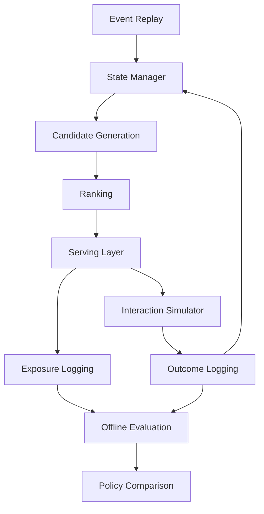
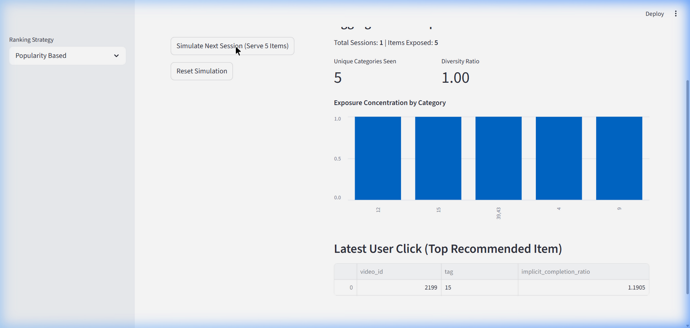

# DiscoveryRank: Recommendation Quality Evaluation Lab

**Author:** Jasjyot Singh  
**Release Status:** v2.0 – End-to-End Online Recommendation Loop

> **Repo Description:** An ML experimentation lab simulating recommendation quality tradeoffs, diversity, and filter-bubble risks using the KuaiRand dataset. Now extended with a full end-to-end recommendation system loop: event replay → state management → serving → logging → simulation → offline evaluation.  
> **Suggested GitHub Topics:** `machine-learning`, `recommender-systems`, `evaluation-framework`, `mlflow`, `streamlit`, `python`

---

## What It Does
This project provides a robust offline framework to evaluate recommendation ranking strategies beyond raw engagement accuracy. Most recommender evaluations optimize for a single dimension—like click-through rate. However, maximizing clicks often traps users in repetitive filter bubbles with zero discovery of new content.

DiscoveryRank evaluates ranking strategies across six simultaneous dimensions: **Relevance**, **Freshness**, **Diversity**, **Repetition Risk**, **Novelty**, and **Serendipity**, using the [KuaiRand-1K](https://kuairand.com/) short-video interaction dataset. It generates realistic candidate pools, ranks them using both ML models (SVD) and fast heuristics (Diversity-aware rerankers), and tracks the tradeoffs transparently via local MLflow.

### Online Recommendation Loop (v2.0)
The system now includes a full **end-to-end recommendation loop** that demonstrates how offline evaluation integrates with online serving:

```
Event Replay → State Update → Candidate Generation → Ranking → Serving → Logging → Simulation → Offline Evaluation
```

This loop:
1. **Replays** historical interaction events as a chronological stream
2. **Maintains** real-time user/item/session state in memory
3. **Generates** recommendations using pluggable ranking policies
4. **Simulates** user reactions with stochastic behavioral heuristics
5. **Logs** both exposure and outcome data
6. **Evaluates** and compares policies on CTR, watch time, coverage, diversity, and creator spread

---

## System Architecture



### Module Map

| Layer | Module | Responsibility |
|-------|--------|---------------|
| **Events** | `src/data/event_schema.py` | Canonical event dataclass with validation |
| **Events** | `src/data/event_replay.py` | Chronological event stream from historical data |
| **State** | `src/features/state_manager.py` | Central state coordinator |
| **Serving** | `src/serving/recommender_service.py` | Recommendation pipeline (candidates → ranking → top-K) |
| **API** | `src/api/recommendation_api.py` | FastAPI layer exposing `GET /recommend` |
| **Logging** | `src/logging_layer/exposure_logger.py` | Recommendation exposure logs |
| **Logging** | `src/logging_layer/outcome_logger.py` | User interaction outcome logs |
| **Simulation** | `src/simulation/interaction_simulator.py` | Stochastic behavioral simulator |
| **Evaluation** | `src/evaluation/policy_backtest.py` | Multi-policy backtest orchestrator |
| **Evaluation** | `src/evaluation/metrics_extensions.py` | CTR, watch time, coverage, diversity, creator spread |
| **CLI** | `run_simulation.py` | CLI loop orchestrating the end-to-end experiment |

---

## Quick Start & Demo

### 1. Run the Full Experiment via CLI
Execute the entire simulation loop for a specific policy from the command line:
```bash
python run_simulation.py --policy hybrid --events 10000
```
*(Produces a metrics summary and saves `policy_comparison.csv` and a bar chart `.png` to `outputs/experiments/`)*

### 2. Run the API locally
Serve recommendations dynamically via a lightweight REST layer:
```bash
uvicorn src.api.recommendation_api:app --reload
```
Test with: `http://127.0.0.1:8000/recommend?user_id=1&session_id=1_1&k=5`

---

## Business / Product Outcome
This project demonstrates how ML and product teams can proactively measure and mitigate the negative side effects of engagement-optimized algorithms before deploying them to production. 

- **For ML Engineers:** Provides a reproducible two-stage offline evaluation pipeline (Candidate Generation → Ranking) that captures real-world tradeoffs between matrix factorization baselines and heuristic rerankers.
- **For Product Managers/Data Scientists:** Proves that applying a lightweight diversity reranker can double tag diversity and increase serendipity by 5x without losing Top-20 relevance compared to a pure popularity baseline.

## Why This Matters
Offline metrics translate directly into long-term product health:
- **Discovery (Novelty & Serendipity):** Algorithms that score high here introduce users to relevant content outside their immediate history, extending long-term retention.
- **Repeated Exposure Risk:** If consecutive repetition rate is high, session satisfaction degrades. Algorithms must actively penalize "same creator, same topic" loops.
- **Catalog Fairness (Coverage):** High engagement models often concentrate impressions on a small fraction of popular content. Measuring 'Global Coverage' ensures niche creators still receive exposure.
- **Long-term User Experience:** A recommendation system that avoids filter bubbles preserves engagement without exhausting the user's core interests.

---

## Visual Proof

### Interactive Filter Bubble Simulator
A visual tool demonstrating how algorithm choice alters a user's exposure over repeated sessions.


### Recommendation Tradeoffs (Relevance vs. Novelty)
A clear look at the tradeoff profile of different strategies across evaluated sessions.


---

## Setup & Reproduction

It takes less than 2 minutes to run the entire supervised lab locally.

### 1. Install Dependencies
```bash
python -m venv .venv
source .venv/bin/activate    # Windows: .venv\Scripts\activate
pip install -r requirements.txt
```

### 2. Full Pipeline Run (Recommended)
This command safely executes all analysis notebooks, extracts metrics, generates clean tradeoff plots (PNGs), and logs the experiment to a local MLflow file store.
```bash
python run_all.py
```
*(Requires KuaiRand-1K CSVs in `data/`)*

### 3. Run the Online Recommendation Loop
Execute the end-to-end policy comparison notebook:
```bash
jupyter nbconvert --to notebook --execute notebooks/06_online_loop_policy_comparison.ipynb --output 06_online_loop_policy_comparison.ipynb
```
This will:
- Replay events and build state
- Generate recommendations with 3 policies (Popularity, Recency Decay, Hybrid)
- Simulate outcomes and log everything to `outputs/logs/`
- Produce `outputs/policy_comparison.csv` and visual charts

### 4. Launch the Interactive Simulator
The simulator visually breaks down what repeated offline sessions look like from the user's perspective.
```bash
streamlit run app/filter_bubble_simulator.py
```

### 5. View Experiment Tracking Artifacts
To compare metrics and generated plots across different strategy combinations, launch the local MLflow UI:
```bash
mlflow ui
```
*Open `http://localhost:5000` to inspect hyperparameters, CSV summaries, and attached plot artifacts.*

---

## Output Artifacts

### Offline Evaluation (`python run_all.py`)
- `outputs/runs/<timestamp>/tables/` — Strategy comparison CSVs
- `outputs/runs/<timestamp>/plots/` — Automated PNG plots
- `outputs/runs/<timestamp>/artifacts/` — Config snapshots

### Online Loop (`notebooks/06_online_loop_policy_comparison.ipynb`)
- `outputs/logs/` — Exposure and outcome CSVs per policy
- `outputs/experiments/` — Per-policy result files
- `outputs/policy_comparison.csv` — Final comparison table

---

## What the Interactive Simulator Shows
The included Streamlit app (`app/filter_bubble_simulator.py`) loads the repository's deterministic dataset to simulate repeated user sessions.
- **Strategy Selection:** Pick between Popularity-based, Diversity-Aware, or Random baselines.
- **Exposure Tracking:** See exactly how the diversity ratio and category concentration change as you simulate subsequent user clicks.
- **Feedback Loops:** Watch how the underlying engine boosts engagement probabilities based on historical click patterns, visualizing the creation of a filter bubble.

---

## The Online Recommendation Path (Why Offline Matters)

Evaluating recommendation algorithms offline using historical logs is necessary to narrow down promising strategies, but offline evaluation is structurally insufficient for proving online success.

### How this maps to Production Serving
In a real-world system, these offline candidate pools and heuristics operate within a live feedback loop:
1. **Candidate Retrieval**: High-speed recall databases (e.g. ANN, Vector DBs) retrieve ~1000 candidates based on recent user clicks.
2. **First-Stage Ranking**: Lightweight models filter this down to ~100 items (similar to the pool size evaluated in this lab).
3. **Heavy Ranking & Reranking**: The strategies tested here (e.g., Diversity-aware penalties) are applied at this final stage to construct the visible UI feed.
4. **Event Logging & Feedback Loop**: Client interactions (click, watch time, ignore) are logged. This data directly updates the user's profile and trains the collaborative filtering model (like our SVD baseline) for the next session.

### Avoiding the Filter Bubble Trap
If a **Popularity-only** strategy is deployed online, the user's event log immediately fills with top-tier, homogenous items. When the model retrains on this data, it becomes overly confident in a very narrow feature space, accelerating a "filter bubble". By establishing robust offline metrics (Novelty, Serendipity, Coverage) and testing **Diversity-Aware** rerankers offline, we mitigate the risk of deploying a strategy that maximizes Day 1 engagement but collapses long-term discovery.

---

## What This Is Not
- **This is not a production serving system.** It is a strong offline experimentation and evaluation layer designed to measure algorithmic tradeoffs before live deployment. There is no live backend database.
- **The Streamlit simulator is a simulation.** It runs entirely locally using historical offline dataset logic to demonstrate conceptual filter-bubble risks, it does not serve live traffic.
- **This is not ALS.** The original plan favored the `implicit` library (ALS), but it requires C++ build tools. The working implementation uses scipy's truncated SVD as a dependency-free fallback to represent a structural matrix factorization baseline without installation friction.
