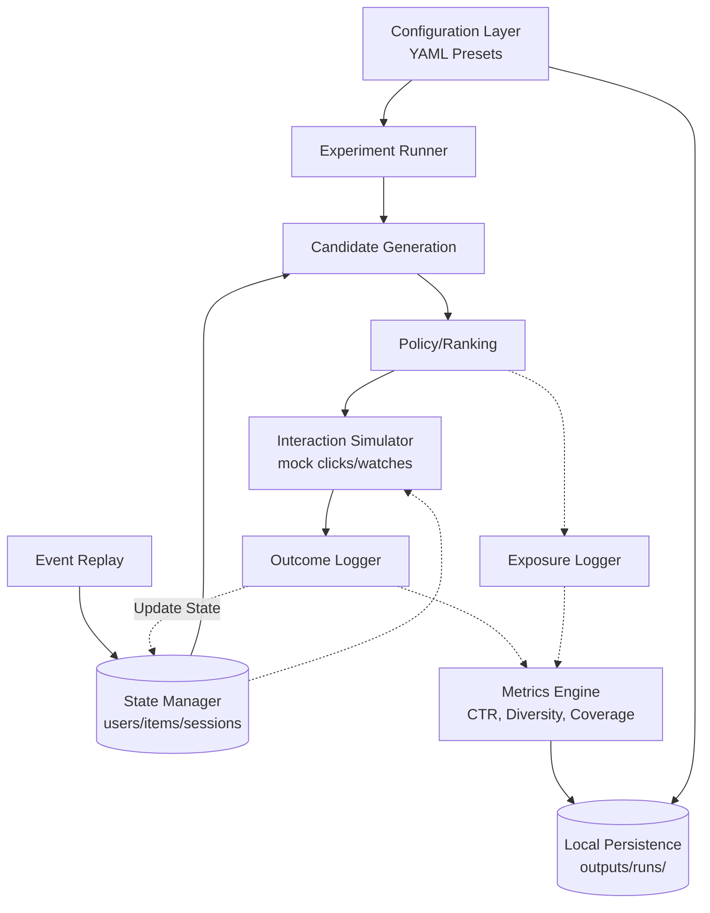

# DiscoveryRank: Recommendation Strategy Lab & Online Loop

**Author:** Jasjyot Singh  
**Release Status:** v3.0 – Recommendation Strategy Lab

> **Repo Description:** Explore recommendation tradeoffs locally. An end-to-end short-video recommendation system prototype wrapped in a plug-and-play experimentation lab. Test how ranking logic impacts user exposure over time without needing cloud infrastructure.

---

## What It Does

DiscoveryRank has been upgraded into a local **Recommendation Strategy Lab**. It allows PMs, HR, or technical reviewers to run fast, simulated A/B tests on recommendation algorithms. 

By running the continuous online simulation loop, the lab captures the long-term impacts of ranking algorithms. It uses offline metrics like Click-Through Rate (proxy), Diversity, Novelty, and Serendipity to measure how algorithms physically reshape a user's catalog exposure over time. 

Compare presets like "Cold Start Catalog" against "Popularity Trap", swap out strategies like "Freshness Boost" vs "Balanced Discovery", and see the tradeoffs immediately in your browser.

---

## 🧪 Quick Start: The Lab Interface

It takes about 1-2 minutes to run an experiment locally. All data is persisted to your local machine.

### 1. Install Dependencies
```bash
python -m venv .venv
source .venv/bin/activate    # Windows: .venv\Scripts\activate
pip install -r requirements.txt
```

### 2. Launch the Streamlit UI (Recommended)
Launch the lightweight, local-first web interface to pick presets, run simulations, and view charts:
```bash
streamlit run app.py
```

### 3. Run via CLI
If you prefer the terminal, you can execute config-driven experiments directly:
```bash
python -m src.run_experiment --preset cold_start_catalog --strategy popularity_first --open-report
```
*Tip: You can compare your last two runs by adding the `--compare-last` flag.*

---

## System Architecture

The prototype relies on cyclical interaction between the serving layer and the simulation environment, now governed by the central Configuration Layer:



---

## Output Structure

Every experiment you run generates a self-contained, timestamped folder under `outputs/runs/`, ensuring no data is lost:

```text
outputs/runs/20260311_115521_cold_start_catalog_popularity/
├── config.yaml          # The exact active configuration merged from presets
├── metrics.csv          # Final evaluation metrics
├── recommendations.csv  # Top 1000 logged recommendations
├── summary.md           # Generated plain-English analysis of the outcome
└── plots/
    └── metrics_summary.png
```
You can view all past runs natively in the Streamlit UI or by reading the `outputs/experiment_index.csv`.

---

## Results & Tradeoffs

Running the lab scenarios reveals classic recommendation system tensions:
- **Popularity-based Policies** win immediate proxy engagement (highest CTR and Watch Time) but suffer from the lowest diversity, creator spread, and catalog coverage. They quickly trap users in filter bubbles.
- **Hybrid (Diversity-Aware) Policies** win layout diversity, creator spread, and overall catalog coverage, explicitly trading a slight drop in immediate engagement for massive gains in discovery.

---

## Limitations

Please evaluate this prototype with the following constraints in mind:

1. **Local Prototype:** This is a sophisticated experimentation lab, not a web-scale production system. There is no live backend database. All artifacts are strictly saved locally to the file system.
2. **Simulated Feedback:** The `InteractionSimulator` approximates human behavior using heuristic probabilities based on user history. It is deterministic enough to prove the ranking math works, but it does not represent actual human volatility.
3. **No LLM Usage:** The `summary.md` generation heavily relies on deterministic, rule-based text mapping to ensure stability and local capability.
4. **In-Memory State:** The `StateManager` holds user/item representations entirely in application memory via dictionaries rather than a persistent Feature Store or Redis cache.
