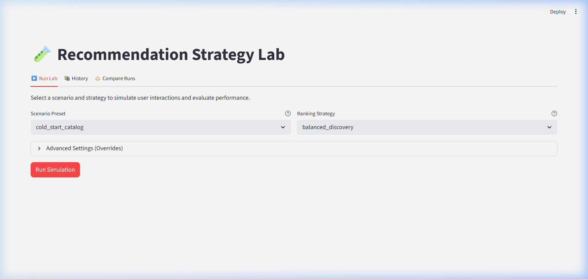
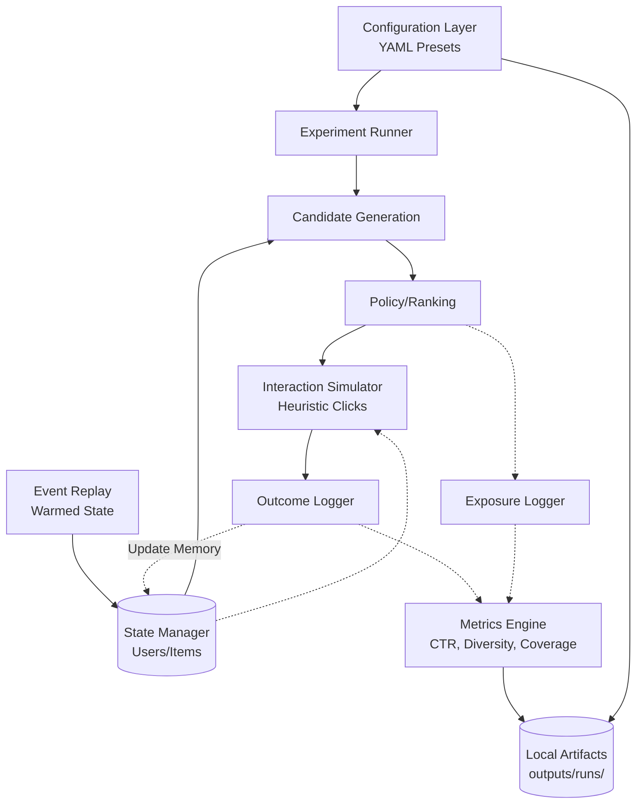
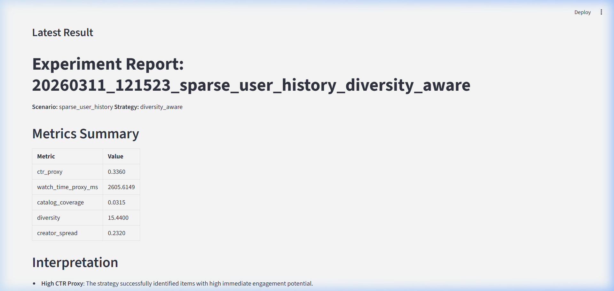
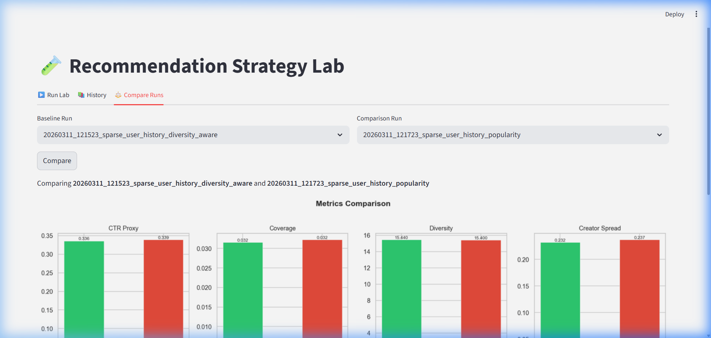
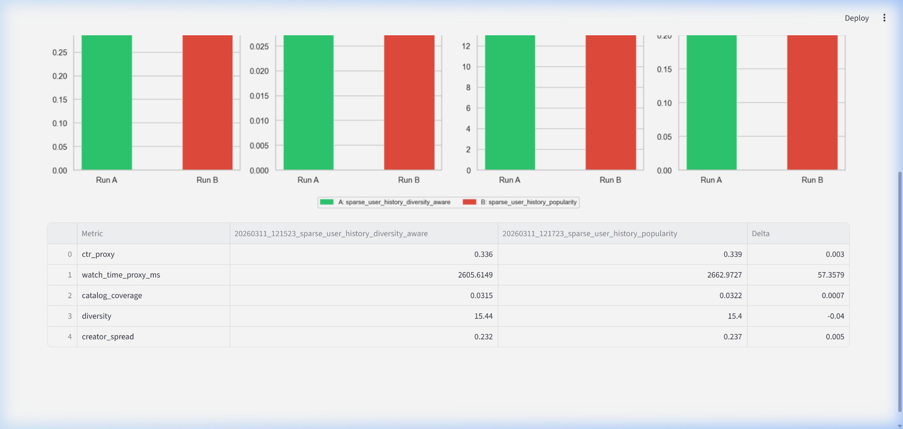

# Recommendation Strategy Lab

> **Explore recommendation tradeoffs locally.** An end-to-end short-video recommendation system prototype wrapped in a plug-and-play experimentation lab. Test how ranking logic impacts user exposure over time without needing cloud infrastructure.



---

## 🔬 What This Is

A local **Recommendation Strategy Lab**. It allows Product Managers or ML Engineers to run fast, simulated A/B tests on recommendation algorithms. 

By running a continuous online simulation loop, the lab captures the long-term impacts of ranking algorithms. It uses offline metrics like Click-Through Rate (proxy), Diversity, Novelty, and Serendipity to measure how algorithms physically reshape a user's catalog exposure over time. 

## 💡 Why It Matters

Production recommender systems often fall into the "Popularity Trap"—optimizing for immediate clicks at the expense of long-term catalog diversity. This lab makes those tradeoffs visible. Compare presets like "Cold Start Catalog" against "Popularity Trap", swap out ranking strategies like "Freshness Boost" vs "Balanced Discovery", and see the tradeoffs immediately in your browser.

## ✨ Key Capabilities

- **Config-Driven Scenarios:** Define user behavior and catalog properties via clean YAML presets.
- **Pluggable Ranking:** Swap out ranking algorithms instantly.
- **Continuous Simulation Loop:** Simulates user interactions and logs exposure dynamically over time.
- **Deterministic Summarization:** Auto-generates readable Markdown reports interpreting metrics without relying on LLMs.
- **Local Analytics GUI:** Compare run metrics and distributions visually via a lightweight Streamlit interface.

---

## 🛠️ System Architecture Workflow



---

## 🚀 Quick Start

1. **Install Dependencies**
   ```bash
   python -m venv .venv
   source .venv/bin/activate    # Windows: .venv\Scripts\activate
   pip install -r requirements.txt
   ```

2. **Launch the Streamlit UI**
   ```bash
   streamlit run app.py
   ```
   *Navigate to `http://localhost:8501` to use the visual interface.*

---

## 💻 CLI Usage

If you prefer the terminal, execute config-driven experiments directly:

```bash
# Run a specific scenario and strategy
python -m src.run_experiment --preset cold_start_catalog --strategy popularity_first --open-report

# Compare the last two runs side-by-side
python -m src.run_experiment --compare-last
```

---

## 🕹️ Scenarios & Strategies

The lab operates on the intersection of **Scenarios** (environment setups) and **Strategies** (ranking logic).

### Preset Scenarios (`configs/presets/`)
- `cold_start_catalog`: Focuses on fresh, unobserved items.
- `trending_content_push`: High popularity skew setup.
- `popularity_trap`: Highlights the danger of pure CTR optimization leading to low diversity.
- `sparse_user_history`: Tests recommendations for new users.

### Ranking Strategies (`configs/strategies/`)
- `popularity_first`: Pure engagement proxy ranking.
- `freshness_boost`: Heavy time decay applied to scores.
- `balanced_discovery`: Moderate freshness + diversity re-ranking.
- `creator_diversity`: Strict creator window constraints.
- `exploration_heavy`: Very high random/unseen item inclusion.

---

## 📸 Screenshots Gallery

### Simulated Run Results

*Full evaluation reports and offline metrics are generated after every simulation pass.*

### Visualizing Strategy Tradeoffs

*Compare the structural impacts of algorithms (e.g., CTR vs. Creator Spread) side-by-side.*



---

## 📁 Output Artifact Structure

Every experiment generates a self-contained, timestamped folder under `outputs/runs/`:

```text
outputs/runs/20260311_115521_cold_start_catalog_popularity/
├── config.yaml          # Merged config applied
├── metrics.csv          # Final evaluation metrics
├── recommendations.csv  # Logged top-K recommendations 
├── summary.md           # Generated analytical report
└── plots/
    └── metrics_summary.png
```

---

## ⚠️ Limitations

1. **Local Prototype:** Designed for local experimentation. No live database or backend cache.
2. **Simulated Feedback:** The `InteractionSimulator` uses heuristic probabilities based on user history. It demonstrates ranking logic but is an approximation of human volatility.
3. **In-Memory State:** Operates entirely in application RAM via `StateManager` dictionaries instead of a persistent Feature Store.

---

## 📂 Repository Structure

```text
recommendation-quality-lab/
├── app.py                      # Primary Streamlit UI entrypoint
├── src/                        # Core recommendation and simulation engines
├── configs/                    # YAML definitions for presets and strategies
├── tests/                      # Pytest suite
├── docs/                       # Internal implementation notes and screenshots
├── notebooks/                  # Deeper analytical notebooks
├── outputs/                    # Local run artifacts (ignored in Git)
└── archive/                    # Archived legacy runners and scripts
```
